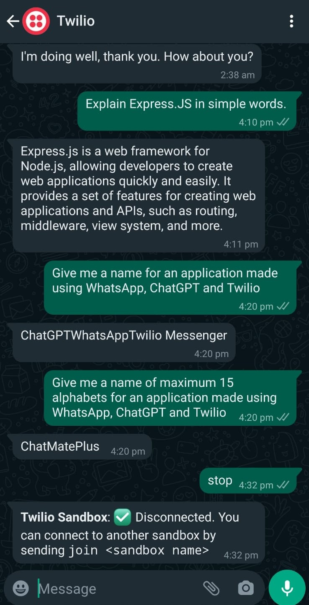

### About:

This is a Whatsapp chatbot application made using OpenAI and Twillio. 

### Motivation:

I made this because it allows me to use ChatGPT even when the website is down. I also wanted to use ChatGPT on Whatsapp instead of website or telegram. Although there are many repositories like [this](https://github.com/danielgross/whatsapp-gpt), [this](https://github.com/pascalroget/whatsgpt) and [this](https://github.com/Santosl2/wpp-chatgpt) available that claim to provide this but none of them worked for me even on my local system, let alone deploying online. I got a little bit free time after exams ended so I created my own bot that works seamlessly on Windows and Linux (not tested on Mac but since Mac is based on Unix shell, it should work there too). 

### Steps to make this code work on your local machine:

1. Create a Twilio account (requires you to verify phone number).
2. Go to Twilio Console and get a phone number from Twilio Console.
3. Take Account SID, Auth Token and Phone number from there and put them in the env file
4. Run `pip install -r requirements.txt` in the root directory of the repository.
5. Run `ngrok http 5000` in the terminal. It will start an ngrok server and give you a link. Copy that link.
6. Go to Messaging > Settings > WhatsApp Sandbox Settings and paste the link in "WHEN A MESSAGE COMES IN" field there. Append `/message` to that link. Make sure its set to HTTP Post. Dont touch anything else.
7. Send a whatsapp message (from your actual whatsapp account) to the phone number you received from Twilio and the message content should be joining sandbox code like `join hello-world`
8. Send a message (which would act as a prompt to the ChatGPT). Wait for the response (doesnt take more than 5 seconds).
9. Once done playing with it, you can send `stop` to the number in order to exit the Twilio Sandbox.
10. Keep learning.

### Steps to deploy the code online:

All steps except 3,4 and 5 is same as earlier. Clone this repository to your github account and instead of running it locally, sign up for a new account on https://render.com and click the option to create a web service. Authorize github and connect to the cloned repository. Make sure your Build Command is `pip install -r requirements.txt` and Start Command is set to `gunicorn app:app`. Click the `Advanced` button present above the `Create Web Service` and configure the 3 environment variables as mentioned in Step 3 earlier. Leave other settings as default. Click `Create Web Service`  button which would start the build. Once the build is successful, you'll receive a URL like `https://helloworld.onrender.com`. Go to that URL and make sure it says "Home Page". Copy that link. And continue from Step 6 present above. The "/message" needs to be appended for this link too.

### Screenshot:

